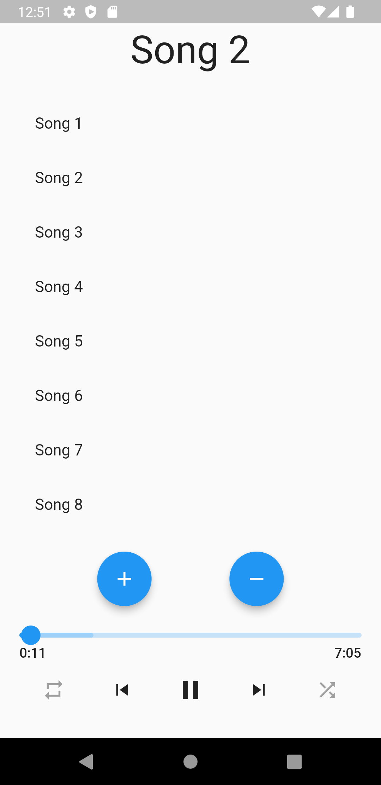
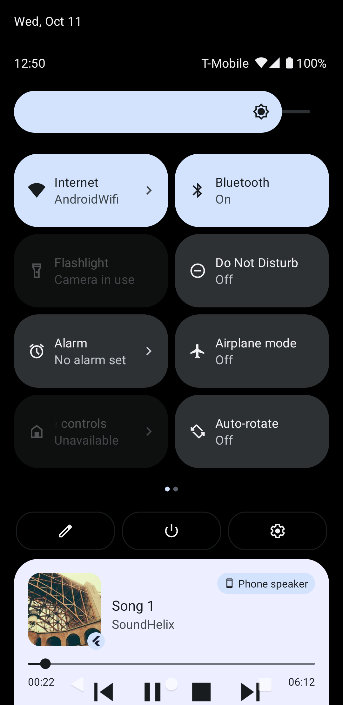
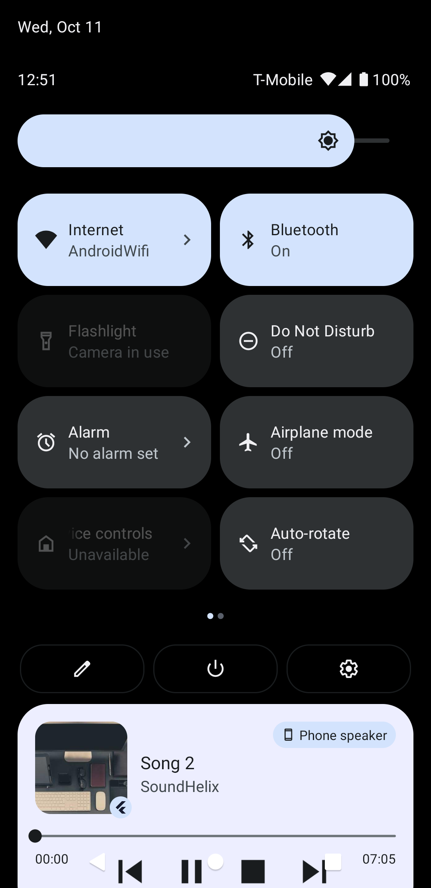

# Audio Flutter App

Audio Flutter App is a versatile mobile application designed for playing audio files with ease. This app leverages the power of the UST audio library and the audio service library to provide a seamless and feature-rich audio playback experience for users.
## Screenshots

| Home Page | background audio | switch audio |
| ----------- | ----------- | ----------- |
||||
## Features

- **Audio Playback**: Enjoy your favorite audio files using the UST audio library. With this library, you can harness sound in various ways, delivering high-quality audio playback.

- **Background Playback**: The audio service library allows you to use the application in the background, ensuring that your users can listen to their favorite tunes while using other apps or with the screen turned off.

- **Playlist Expansion**: One of the key features we're working on is expanding the number of songs in the playlist. This will enable users to create extensive playlists filled with their favorite tracks.

- **Random Audio Shuffling**: We're also working on adding a random shuffle feature to make the listening experience more dynamic and exciting. Users will be able to enjoy their music collection in a new and unexpected way.

## Libraries Used

Here are the libraries used in the project:

| Library               | Description                                                                          | Link                                                            |
| --------------------- | ------------------------------------------------------------------------------------ | --------------------------------------------------------------- |
| Just Audio     | A powerful library for handling audio, providing various sound manipulation options. | [just audio library](https://pub.dev/packages/just_audio)                         |
| Audio service library | Enables background audio playback, allowing the app to run while in the background.  | [Audio service library](https://pub.dev/packages/audio_service) |

## Installation

To get started with the Audio Flutter App, follow these simple steps:

1. Clone this repository to your local machine:
   git clone https://github.com/abdulrahmanHatem911/audio_demo.git

2. Install the required dependencies using Flutter:
   flutter pub get

3. Run the app on an emulator or a physical device:
   flutter run

## Contact

If you have any questions, suggestions, or just want to say hello, you can reach out to us on:

- GitHub: [abdulrahmanHatem](https://github.com/abdulrahmanHatem911)
- LinkedIn: [abdulrahmanHatem]( https://www.linkedin.com/in/abdulrahman-hatem-64780a210)
- Twitter: [abdulrahman](https://twitter.com/Abdelra87827997)

We hope you enjoy using the Audio Flutter App as much as we enjoyed creating it!
